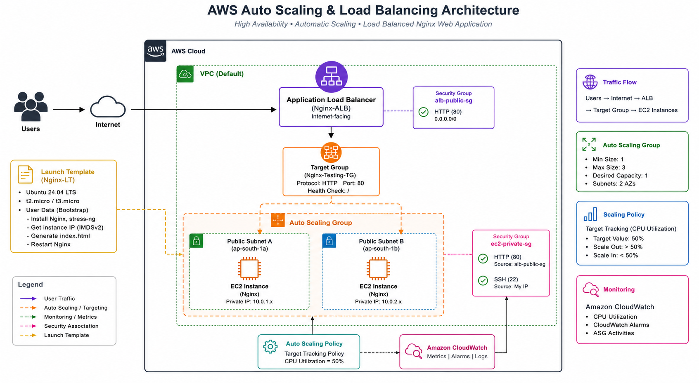
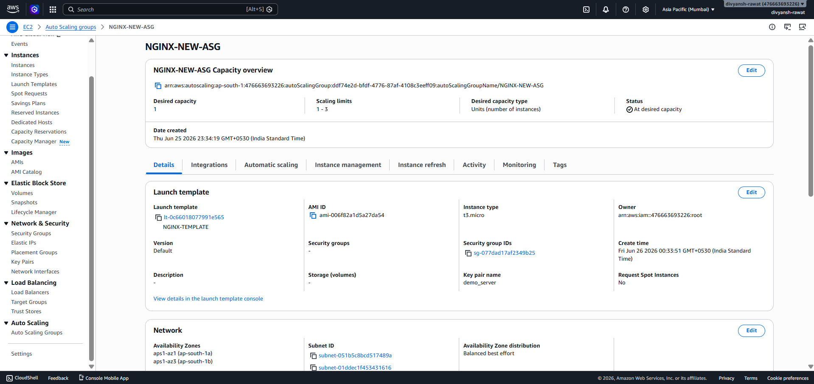
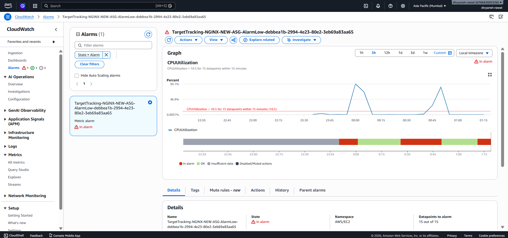
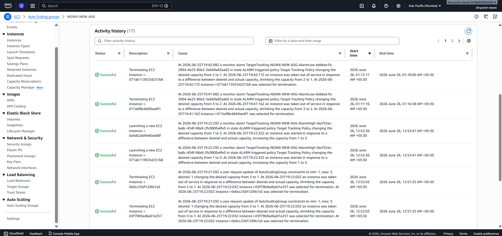
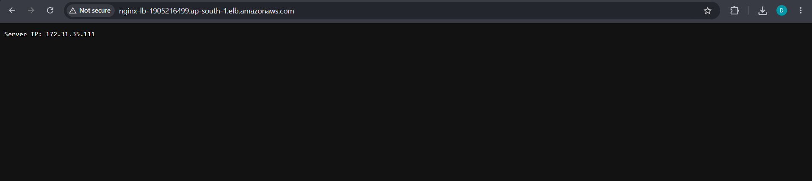
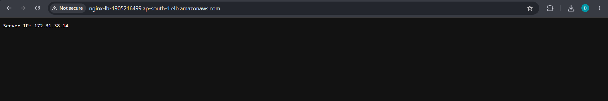

# AWS Auto Scaling & Load Balancing Lab


## Project Overview

This project demonstrates how to build a highly available and scalable web application infrastructure on AWS using Auto Scaling Groups (ASG), an Application Load Balancer (ALB), CloudWatch monitoring, and Nginx.

The infrastructure automatically launches additional EC2 instances when CPU utilization increases and distributes incoming traffic across healthy instances through an Application Load Balancer.

### Key Features

* High Availability using multiple Availability Zones
* Automatic Scale-Out and Scale-In
* Application Load Balancing
* CloudWatch Monitoring and Metrics
* Launch Template Automation
* Nginx Web Server Deployment
* Security Group Segmentation
* Load Testing with stress-ng

---

## Architecture



### Architecture Flow

```text
Public User
     │
     ▼
Application Load Balancer (ALB)
     │
     ▼
Target Group
     │
 ┌───┴───┐
 ▼       ▼
EC2     EC2
(Nginx) (Nginx)
     ▲
     │
Auto Scaling Group
     ▲
     │
CloudWatch Metrics
```

---

## Technologies Used

| Service                   | Purpose               |
| ------------------------- | --------------------- |
| Amazon EC2                | Web Servers           |
| Auto Scaling Group        | Automatic Scaling     |
| Application Load Balancer | Traffic Distribution  |
| CloudWatch                | Monitoring & Metrics  |
| Launch Templates          | Instance Provisioning |
| Ubuntu 24.04 LTS          | Operating System      |
| Nginx                     | Web Server            |
| stress-ng                 | CPU Load Testing      |

---

## Key Learning Outcomes

Through this project I learned how to:

* Configure an Application Load Balancer
* Implement Auto Scaling based on CPU utilization
* Create reusable Launch Templates
* Configure CloudWatch metrics and alarms
* Perform load testing using stress-ng
* Validate high availability across multiple EC2 instances
* Apply security best practices using Security Groups
* Troubleshoot AWS networking and scaling configurations

---

## Demo Screenshots

### Architecture Diagram


### Auto Scaling Group Configuration



### CloudWatch Alarm Triggered



### Auto Scaling Activity



### Load Balancer Distributing Traffic





---

## Project Structure

```text
aws-autoscaling-nginx-lab/
│
├── README.md
├── architecture/
│   └── architecture-diagram.png
│
├── screenshots/
│   ├── 01-alb-created.png
│   ├── 02-target-group.png
│   ├── 03-launch-template.png
│   ├── 04-asg-config.png
│   ├── 05-cloudwatch-alarm.png
│   ├── 06-scaling-activity.png
│   ├── 07-target-group-healthy.png
│   ├── 08-nginx-page-instance-1.png
│   └── 09-nginx-page-instance-2.png
│
└── scripts/
    └── user-data.sh
```

---

# Lab Documentation

## Architecture Objective

Deploy a highly available, auto-scaling web application using Nginx. The infrastructure automatically scales out when CPU utilization spikes and scales in when traffic decreases while an Application Load Balancer distributes incoming traffic across healthy instances.

---

## Prerequisites: Security Group Preparation

### Load Balancer Security Group

**Name:** `alb-public-sg`

Inbound Rules:

| Type | Port | Source    |
| ---- | ---- | --------- |
| HTTP | 80   | 0.0.0.0/0 |

### EC2 Instance Security Group

**Name:** `ec2-private-sg`

Inbound Rules:

| Type | Port | Source        |
| ---- | ---- | ------------- |
| HTTP | 80   | alb-public-sg |
| SSH  | 22   | My IP         |

---

## Phase 1: Set Up Network Routing

### Step 1: Create Target Group

* Name: `Nginx-Testing-TG`
* Target Type: Instance
* Protocol: HTTP
* Port: 80

### Step 2: Create Application Load Balancer

* Name: `Nginx-ALB`
* Scheme: Internet-facing
* Listener: HTTP:80
* Target Group: `Nginx-Testing-TG`

Select at least two Availability Zones for high availability.

---

## Phase 2: Automation Engine

### Create Launch Template

* Name: `Nginx-LT`
* AMI: Ubuntu Server 24.04 LTS
* Instance Type: t2.micro / t3.micro
* Security Group: ec2-private-sg

### User Data Script

```bash
#!/bin/bash

sudo apt-get update

sudo apt-get install nginx stress-ng -y

sudo tee /etc/nginx/sites-available/default > /dev/null << 'EOF'
server {
    listen 80;
    server_name localhost;

    location / {
        default_type text/plain;
        return 200 "Server IP: $server_addr\n";
    }
}
EOF

sudo nginx -t
sudo systemctl restart nginx
```

---

## Create Auto Scaling Group

### Configuration

| Setting          | Value                   |
| ---------------- | ----------------------- |
| Name             | NGINX-ASG               |
| Desired Capacity | 1                       |
| Minimum Capacity | 1                       |
| Maximum Capacity | 3                       |
| Metric           | Average CPU Utilization |
| Target Value     | 15%                     |
| Warmup           | 60 Seconds              |

### Note

The scaling threshold was intentionally configured to **15% CPU utilization** for demonstration purposes so scaling events occur quickly during testing.

---

## Testing Auto Scaling

### Verify Baseline

* Wait for the first instance to become healthy
* Open ALB DNS URL
* Verify Nginx page loads correctly

### Generate CPU Load

SSH into the EC2 instance and run:

```bash
stress-ng --cpu 0 --cpu-load 85 --timeout 10m
```

### Observe AWS Response

* CloudWatch alarm enters ALARM state
* Auto Scaling Group launches new EC2 instance
* Target Group registers new instance
* Load Balancer distributes traffic across instances

---

## Results

### Initial State

| Metric            | Value |
| ----------------- | ----- |
| Desired Capacity  | 1     |
| Running Instances | 1     |
| Healthy Targets   | 1     |

### Load Test

```bash
stress-ng --cpu 0 --cpu-load 85 --timeout 10m
```

### AWS Response

* CPU utilization increased
* CloudWatch alarm triggered
* Auto Scaling Group launched a new EC2 instance
* Target Group registered the new instance
* Load Balancer distributed requests across both servers

### Final State

| Metric            | Value |
| ----------------- | ----- |
| Running Instances | 2     |
| Healthy Targets   | 2     |

---

## Future Improvements

* Deploy instances in private subnets
* Configure HTTPS using AWS Certificate Manager
* Implement Infrastructure as Code using Terraform
* Configure Route 53 custom domain
* Enable CloudWatch Logs
* Deploy using CI/CD pipelines
* Add Blue/Green deployment strategy

---

## Cleanup

To avoid unnecessary AWS charges:

1. Delete Auto Scaling Group
2. Delete Load Balancer
3. Delete Target Group
4. Delete Launch Template (optional)
5. Delete Security Groups (optional)

---

## Author

Built as a hands-on AWS Cloud Engineering project to understand:

* Auto Scaling
* Load Balancing
* CloudWatch Monitoring
* High Availability Architectures
* Infrastructure Automation

